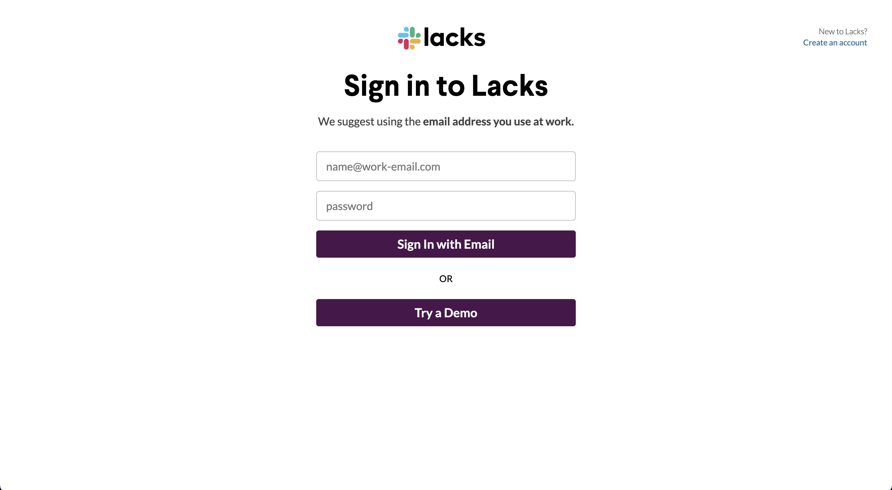
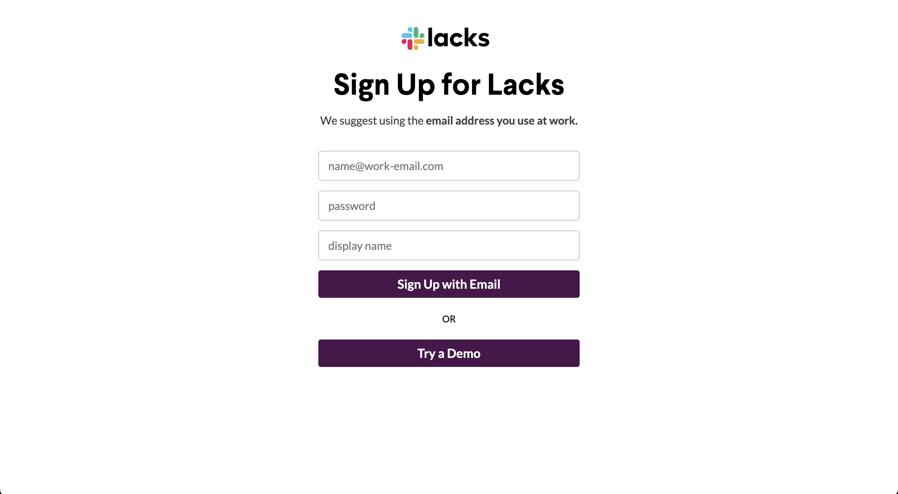
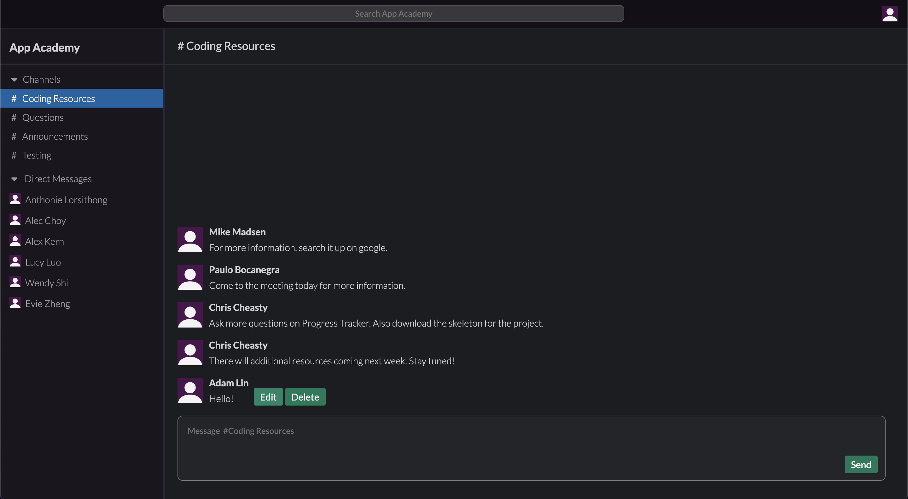

# [Lacks](https://appacademylacks.herokuapp.com/#/)

### [Lacks](https://appacademylacks.herokuapp.com/#/) is a fully interactive clone of the popular work messaging app, Slack. Lacks was created as a demonstration of my abilities in web development and software engineering. 

<br />


<br />

## Technologies Used 
1. Ruby on Rails 
2. React.js
3. Redux

## Functionality

### User Auth 

Users can log into existing accounts and create new ones. These accounts allow them to join workspaces where they can chat with others. Each user's password is salted and hashed for extra security using BCrypt. 

<br />




<br />


### Channels and Conversations

I used a postgreSQL database and designed the database so that a user can have many workspaces. Each workspace also contains many channels and conversations for a specific user. Channels are chats that every user in a workspace can see while conversations are private between users. 

<br />


<br />

### Live Messaging 

To implement live messaging, I learned about websockets and implemented Ruby on Rails' buit-in Action Cable. 

```javascript
enterRoom() {
  this.props.channels.forEach(el => {
    this.subscriptions.push(this.createChannelSubs(el.id))
  });
  this.props.conversations.forEach(el => {
    this.subscriptions.push(this.createConversationSubs(el.id))
  });
}

createChannelSubs(id) {
  return consumer.subscriptions.create(
    {channel: 'ChannelsChannel', id: id},
    {
      received: ({message, type}) => {
        switch (type) {
          case 'RECEIVE_MESSAGE':
            this.props.receiveChannelMessage(message);
            return; 
          case 'DESTROY_MESSAGE':
            this.props.clearChannelMessage(message)
            return;
          default:
            break;
        }
      }
    }
  )
}

createConversationSubs(id) {
  return consumer.subscriptions.create(
    {channel: 'ConversationsChannel', id: id},
    {
      received: ({message, type}) => {

        switch (type) {
          case 'RECEIVE_MESSAGE':
            this.props.receiveConversationMessage(message);
            return 
          case 'DESTROY_MESSAGE':
            this.props.clearConversationMessage(message);
          default:
            break;
        }
      }
    }
  )
}
```

As shown in the code above, I decided to join every Action Cable channel a user belongs to when they enter a workspace. I used a either a conversation's or channel's id as a way to distinguish between Action Cable channels. This allows the user to receive all messages that will be sent to them after they join a channel. Users can also edit and delete messages when they hover over a specific message they sent. 

<br />


 
<br />

### Additional Functionality 
1. Conversations and Channels can be created 

## Possible Bonus Functionality 
1. Search Bar for all users in a certain workspace
2. Ability to create Group chats
3. Launch Lacks opens a new tab
4. Ability to delete conversations
5. Ability to upload custom profile pictures