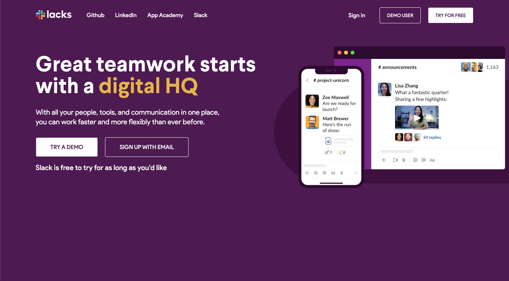
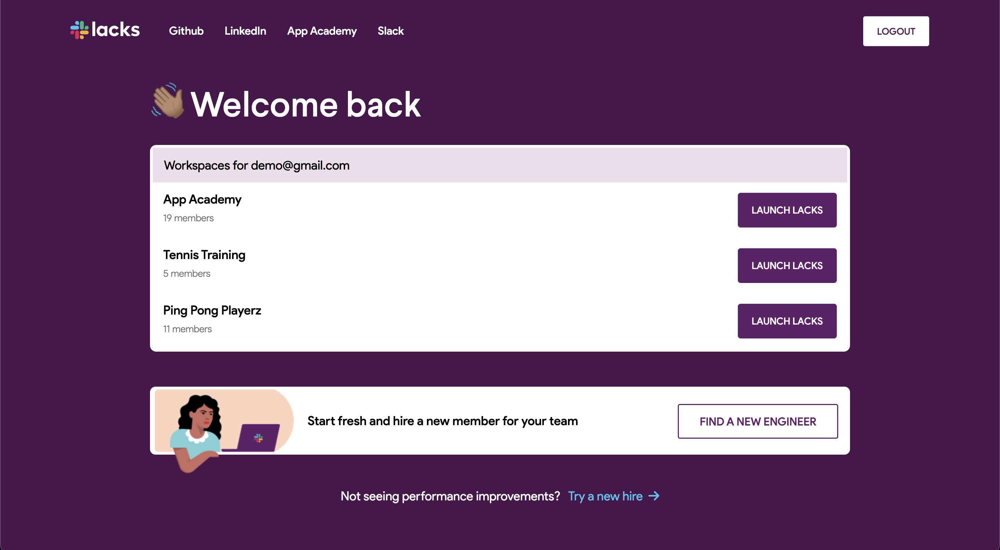
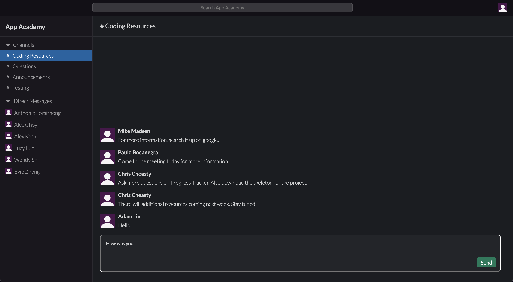

# [Lacks](https://appacademylacks.herokuapp.com/#/)

[Lacks](https://appacademylacks.herokuapp.com/#/) is a fully interactive clone of the popular work messaging app, Slack. Lacks was created as a demonstration of my abilities in web development and software engineering. You can create an account and join workspaces. In these workspaces, there are channels and direct messages where live messaging is enabled.

<br />



<br />

## Technologies Used 
1. Ruby on Rails 
2. React.js
3. Redux

## Functionality

### Channels and Conversations

I used a postgreSQL database and designed the database so that a user can have many workspaces. Each workspace also contains many channels and conversations for a specific user. Channels are chats that every user in a workspace can see while conversations are private between users. 

<br />



<br />

### Live Messaging 
<br />



<br />

To implement live messaging, I learned about websockets and implemented Ruby on Rails' buit-in Action Cable. 

```javascript
enterRoom() {
  this.props.channels.forEach(el => {
    this.subscriptions.push(this.createChannelSubs(el.id))
  });
  this.props.conversations.forEach(el => {
    this.subscriptions.push(this.createConversationSubs(el.id))
  });
}

createChannelSubs(id) {
  return consumer.subscriptions.create(
    {channel: 'ChannelsChannel', id: id},
    {
      received: ({message, type}) => {
        switch (type) {
          case 'RECEIVE_MESSAGE':
            this.props.receiveChannelMessage(message);
            return; 
          case 'DESTROY_MESSAGE':
            this.props.clearChannelMessage(message)
            return;
          default:
            break;
        }
      }
    }
  )
}

createConversationSubs(id) {
  return consumer.subscriptions.create(
    {channel: 'ConversationsChannel', id: id},
    {
      received: ({message, type}) => {

        switch (type) {
          case 'RECEIVE_MESSAGE':
            this.props.receiveConversationMessage(message);
            return 
          case 'DESTROY_MESSAGE':
            this.props.clearConversationMessage(message);
          default:
            break;
        }
      }
    }
  )
}
```

As shown in the code above, I decided to join every Action Cable channel a user belongs to when they enter a workspace. I used a either a conversation's or channel's id as a way to distinguish between Action Cable channels. This allows the user to receive all messages that will be sent to them. 

